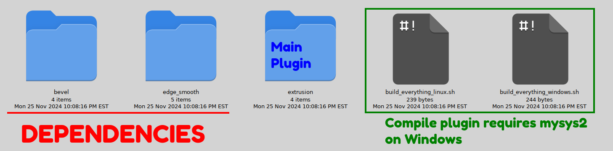

WORK IN PROGRESS COME BACK LATER!!! 
## **Welcome to my GEGL/GIMP Plugin Webpage.**


Hello, My name is Linux beaver and I make GEGL based GIMP Plugins that style text and do workflows relating to cards, banners and Youtube thumbnails. The goal of my GIMP plugins is to help make above described workflows easier on users. This Github.io page was made to simplify the process of users interacting with my Github pages as before it was much more complicated. As in example each plugin had individual repos with 100 individual Github pages, futher more many plugins shared dependencies plugins. As a result it become confusing for end users. Now I am trying to simplify everything with this webpage that will link everything needed for the users. The user will be able to see a preview of my plugin on the webpage, click and download the binaries or follow instructions to go into the main folder and get its source code by running 

```
grab_code.sh
```


grab.code.sh will be ran in a individual folder, which will give you the source code of that plugin and all its dependencies.


 Currently as of November 2024 there will be 90+ main folders for all the plugins and some plugins like "bevel" that is a frequent dependency will only have one folder but grab_code.sh inside a plugin folder that depends on bevel will zip bevel's code alongside the plugin's code that needs bevel.
 
 





[Subpage Text](./subpagetest.md)

## Compile Guide for Linux 


### 1. Downloading the Plugins

Download the Source_Code_of_All_Plugins.zip  


### 2. Installing Required Packages
Before you can use or compile the plugins, you need to have certain packages installed on your Linux system:

- Ninja: A small build system with a focus on speed.
- Meson: An open-source build system meant to be both extremely fast and user-friendly.
- GEGL: The underlying graphics library used by GIMP.

These can typically be installed via your distribution's package manager. For example, on Ubuntu, you can open a terminal and run:

```
sudo apt-get update
sudo apt-get install ninja-build meson libgegl-dev
```

### 3.
Navigate to the plugin you want to compile unless you want to compile all of them. For example navigate to **sharp_bevel** folder because you want to compile sharp bevel from source as opposed to using my precompiled binaries.

### 4. Compiling the Plugins (automated)

**build_linux.sh** | compiles an individual binary of a plugin (not recommended)

**build_plugin_linux.sh** | compiles all binaries a plugin needs on Linux (recommended)

**build_plugin_windows.sh** | compiles all binaries a plugin needs on Windows (recommended)

**grab_code.sh** | grabs all code of an individual plugin to compile on Windows and Linux (recommended)

### 4. Compiling the Plugins (manual)

- If you've downloaded the source code and wish to compile the plugins, follow these steps:
- Extract the Source Code: If the source code comes in a compressed file (like .zip or .tar.gz), extract it first.
- Navigate to the Source Directory: Use the terminal to navigate to the directory where you've extracted the source code.
- Run the Build Script: Execute the build_linux.sh script. This script should automate the compilation process. You can run it by typing:

```
./build_linux.sh

```
Ensure that this script is executable. If not, make it executable by running chmod +x build_linux.sh.

### 5. Installing the Compiled Plugins

- Locate the Compiled .so Files: After compilation, look for .so files in the build directory.
- Copy the .so Files to the GEGL Plugins Directory: Use the command:

```
Linux 
cp [source_path]/*.so /home/$(whoami)/.local/share/gegl-0.4/plug-ins/

Linux  (Flatpak)
cp [source_path]/*.so /home/$(whoami)/.var/app/org.gimp.GIMP/data/gegl-0.4/plug-ins

Do NOT have multiple copies of the binaries or put binaries in separate folders.

```

### 6. Restart GIMP
After copying the files, restart GIMP. The new GEGL operations should now be available in GIMP.

If pre-compiled binaries (.so files) are provided, you can skip the compilation steps. Just copy these .so files directly to the /home/$(whoami)/.local/share/gegl-0.4/plug-ins/ directory and restart GIMP.

